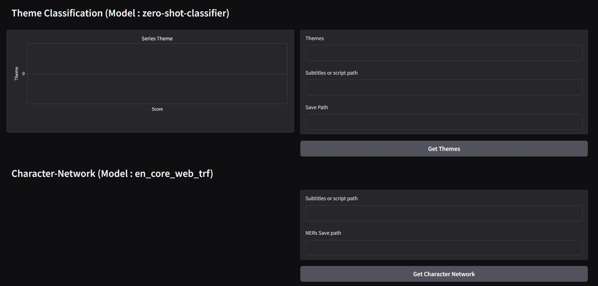

<div style="display: flex; justify-content: space-around; align-items: center;">
  
  
<!--    -->
<!--    -->
</div>

## 📜 llm-tv-series-analysis
#### 🧠 Overview 
A TV-Series analysis system using NLP/LLM , gradio, hugging face , chatbots

#### 🎯 Use Cases 
- Implementing 
  
#### 🟢 Project Status
- Current Version: V1.0
- Actively maintained & expanded

#### 📂 Repository Structure
```
llm-tv-series-analysis/
├── images/
├── crawler/
│   └── .ass
├── data/
│   ├── subtitles/
│   |   ├── datasets_link.txt
│   ├── datasets_link.txt
│   ├── jutsu.jsonl
│   ├── jutsus.jsnol
│   └── naturo.csv
├── stubs/
│   ├── ner_output.csv
│   └── theme_classifier_output.csv
├── text-classification/
│   └── jutsu_classifier_development.ipynb
├── theme-classifier/
│   ├── __init__.py
│   ├── theme_classification_development.ipynb
│   └── theme_classifier.py
├── character-network/
│   ├── __init__.py
│   ├── character_network_generator.ipynb
│   ├── character_network_generator.py
│   ├── named_entity_recognizer.py
│   └── naruto.html
├── utils/
│   ├── __init__.py
│   └── data_loader.py         
├── .gitignore
├── gradio_app.py
├── llm-tv-series-analysis.gdoc
├── llm_tv_series_analysis_development.ipynb
├── requirements.txtx
└── README.md
```

### ✨ Features
- 

### 🎥 Demo
<a href="https://youtu.be/Qor8kjsCJkA?si=7d1Mhc0KW4GQb3sF" target="_blank">
  
</a>

### 🚀 Getting Started
- Knowledge Required : python, linear algebra, probability, statistics, numpy, matplotlib, scikit-learn, pytorch

<!-- ### 🛠️ Hardware Requirements
- None
-->

#### 💻 Software Requirements
- IDE (VS Code) or jupyter notebook or google colab
- Python 3
  
#### 🛡️ Tech Stack
- Python , PyTorch, TorchVision 💻
- Numpy, Pandas, Matplotlib, Scikit-Learn 🧩

<!--
### 🖇️ Schematic
- none
-->

#### ⚙️ Installation
```
git clone https://github.com/pointer2Alvee/llm-tv-series-analysis.git
cd llm-tv-series-analysis-system
```

#### 📖 Usage
- Open .ipynb files inside each concept or NN architecture directory and
- Run them to see training/inference steps, plots, and results.

#### 🔍 Contents Breakdown
##### 📚 Math Foundations
- Linear Algebra, Calculus, Probability, Statistics

##### 🧱 Neural Network Basics
- Perceptrons, Layers, Activations, MLPs


##### 🔧 Deep Learning Concepts
- Regularization (Dropout, L2, Data Aug)


##### ⚙️ Advanced Architectures
- CNNs (classic + modern)


##### 🏋️‍♂️ Model Training & Tracking
- Training Loops, Epochs, Batches


##### 📊 Evaluation
- Accuracy, Precision, Recall, F1, AUC-ROC


##### 🔬 Research to Practice
- Paper Implementations → PyTorch Code


### 🧪 Sample Topics Implemented
- ✅ Forward & Backpropagation from scratch
- ✅ CNN with PyTorch
  
- ⏳ Upcoming  : nlp, cv, llm, data engineering, feature engineering

### 🧭 Roadmap
- [x] Build foundational math notebooks
- [ ] Implement perceptron → MLP → CNN


### 🤝 Contributing
Contributions are welcomed!
1. Fork the repo. 
2. Create a branch: ```git checkout -b feature/YourFeature```
3. Commit changes: ```git commit -m 'Add some feature'```
4. Push to branch: ```git push origin feature/YourFeature```
5. Open a Pull Request.

### 📜License
Distributed under the MIT License. See LICENSE.txt for more information.

### 🙏Acknowledgements
- Special thanks to the open-source community / youtube for tools and resources.
