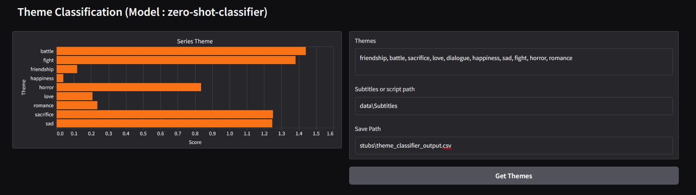
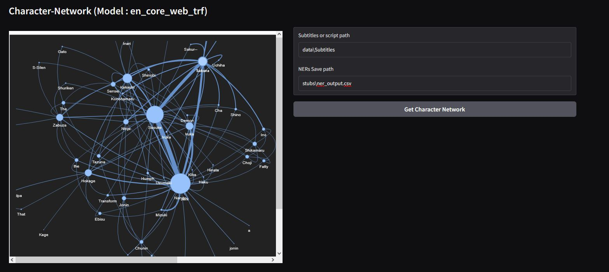

<div style="display: flex; justify-content: space-around; align-items: center;">
  
</div>
<div style="display: flex; justify-content: space-around; align-items: center;">
  
</div>

## 📜 llm-tv-series-analysis
#### 📌 Summary 
An NLP/LLM-powered <b>TV-Series-Analysis</b> System for understanding story elements, character relationships, and theme analysis of any TV show. This AI-system relies on robust tech stack including python, pytorch, gradio, scrapy, beautifulsoup4, glob, sklearn, seaborn, pandas, numpy, matplotlib, spacy, networkx, transformer-models, huggingface, nltk, pyvis. Also used two impressive models, spacy's en_core_web_trf for character network & hugging face's facebook/bart-large-mnli for theme classifier. Expertise in  ML/DL, AI engineering, Neural nets, LLMs, Transformer models & web scraping is beneficial for extending or understanding this system.

#### 🧠 Overview
A comprehensive system to analyze and visualize any TV series —demonstrated here using "Naruto" tv seies— with a user-friendly interface built using Gradio. The system is structured into three major components. 

<b>(1) Gathering Dataset :</b> where 3-types of dataset requierd. These are subtitle, transcript, classification dataset. The subtitle is collected "subtitlist", the transcript from kaggle and the classification data are scraped from "narutopedia" website using Scrapy and BeautifulSoup tool.  

<b>(2) Theme Classification :</b> basically extracts the main theme of the series. It tells us how much each theme (%) is occurring in the TV-Series provided that we have input themes like (comma separated) : friendship, battle, sacrifice, love, dialogue etc. This is done using zero-shot classifier  by leveraging Hugging Face's "facebook/bart-large-mnli" model to extract theme from the subtitle dataset and lastly

<b> (3) Character Network :</b> shows how big each character is and plot their relationship with each other. This uses SpaCy’s NER (Named-Entity-Recognition) model (en_core_web_trf) to identify and connect character entities in a network visualized via Pyvis.


#### 🎯 Use Cases 
- Fandom Analysis & Exploration
- Content Recommendation & Tagging
- Scriptwriter & Creator Insights
- Educational/NLP Research Tool
- Interactive Dashboards for Viewers
- Comparative Series Analysis
- Archiving & Metadata Generation
  
#### 🟢 Project Status
- Current Version: V1.0
- Actively maintained & expanded

#### 📂 Repository Structure
```
llm-tv-series-analysis/
├── images/
├── crawler/
│   └── .ass
├── data/
│   ├── subtitles/
│   |   ├── datasets_link.txt
│   ├── datasets_link.txt
│   ├── jutsu.jsonl
│   ├── jutsus.jsnol
│   └── naturo.csv
├── stubs/
│   ├── ner_output.csv
│   └── theme_classifier_output.csv
├── text-classification/
│   └── jutsu_classifier_development.ipynb
├── theme-classifier/
│   ├── __init__.py
│   ├── theme_classification_development.ipynb
│   └── theme_classifier.py
├── character-network/
│   ├── __init__.py
│   ├── character_network_generator.ipynb
│   ├── character_network_generator.py
│   ├── named_entity_recognizer.py
│   └── naruto.html
├── utils/
│   ├── __init__.py
│   └── data_loader.py         
├── .gitignore
├── gradio_app.py
├── llm-tv-series-analysis.gdoc
├── llm_tv_series_analysis_development.ipynb
├── requirements.txtx
└── README.md
```

### ✨ Features
✅ Dataset gathering (subtitles, transcripts, and custom classification sets)
✅ Zero-shot theme classifier using facebook/bart-large-mnli
✅ Character relationship network using Named Entity Recognition (en_core_web_trf)

🛠️ In progress:
▫️ Attack type classifier (distilBERT-based)
▫️ Chatbot with character personality using fine-tuned LLaMA 3.1

### 🎥 Demo
 <a href="https://www.youtube.com/shorts/wexIv6X45eE?feature=share" target="_blank">
  
</a> 

### 🚀 Getting Started
#### 📚 Knowledge & Skills Required 
- Python programming, Web Scraping 
- ML/DL fundamentals, Transformers, Hugging Face Hub
- NLP tools like NLTK and spaCy
- LLM knowledge for future chatbot development

#### 💻 Software Requirements
- IDE (VS Code) or jupyter notebook or google colab
- Python 3, html, css
  
#### 🛡️ Tech Stack
- Language: python, html, css
- Web Scraping: scrapy, beautifulsoup4
- NLP/ML/LLM: transformers, huggingface_hub, nltk, spacy, sklearn, pandas, numpy, networkx, pyvis
- Deep Learning: pytorch, transformers-models (en_core_web_trf & facebook/bart-large-mnli) 
- Visualization: matplotlib, seaborn, pyvis.network
- UI/ML-app: gradio


#### 🔍 Modules Breakdown
##### 📥 Dataset Collection
- Subtitle Dataset: Main content used for theme classification and character network.
- Transcript Dataset: Maps dialogues to speakers, crucial for chatbot.
- Classification Dataset: Scraped from Naruto Fandom Wiki for training an attack classifier: ninjutsu, genjutsu, and taijutsu.
. Tools used: scrapy, bs4

##### 🎭 Theme Classifier
- Model: facebook/bart-large-mnli (Zero-Shot)
- Input: Subtitle data + custom themes (e.g., friendship, battle, sacrifice)
- Output: CSV showing theme percentages across the series

##### 🧑‍🤝‍🧑 Character Network
- NER Model: en_core_web_trf via spaCy
- Generate interactive network graph using networkx + pyvis

##### 📊 Evaluation
- Furtue work

#### ⚙️ Installation
```
git clone https://github.com/pointer2Alvee/llm-tv-series-analysis.git
cd tv-series-analyzer

# Recommended: Use a virtual environment
pip install -r requirements.txt
```

##### 🖇️ requirements.txt (core packages):
```
scrapy
beautifulsoup4
transformers==4.44.0
huggingface_hub==0.24.5
nltk==3.8.1
gradio
pyvis
spacy
torch
pandas
numpy
networkx
seaborn
matplotlib
```

##### 💻 Running the App Locally
1. Open Repo in VS code
2. Run Command :  ``` python gradio_app.py ```
3. Wait.. 
4. Open Local Host link in Browser

For Theme-Classifier :-
- provide themes in text field: ```friendship, battle, sacrifice, love, dialogue```
- Provide Subtitle Path : ```data\Subtitles```
- Provide output Save path : ```stubs\theme_classifier_output.csv```
- Click "Get Themes" Button

For Character-Netowrk :-
- Provide Subtitle Path : ```data\Subtitles```
- Provide output Save path : ```stubs\ner_output.csv```
- Click "Get Character Network" Button

- On Colab? Use the global URL printed after running this to open the UI in your browser.

#### 📖 Usage
- Open VS Code and run the a bove commands

### 🧪 Sample Topics Implemented
- ✅ Web Scraping
- ✅ BERT model & NER model
- ✅ Theme Classifier, Character Relationship Network
  
- ⏳ Upcoming  : Chatbot, Text Classifier

### 🧭 Roadmap
- [x] Full attack classifier with fine-tuned DistilBERT
- [ ] Fully interactive character chatbot (LLaMA-based)
- [ ] Support for other anime/TV series via config

### 🤝 Contributing
Contributions are welcomed!
1. Fork the repo. 
2. Create a branch: ```git checkout -b feature/YourFeature```
3. Commit changes: ```git commit -m 'Add some feature'```
4. Push to branch: ```git push origin feature/YourFeature```
5. Open a Pull Request.

### 📜License
Distributed under the MIT License. See LICENSE.txt for more information.

### 🙏Acknowledgements
- Special thanks to the open-source community / youtube for tools and resources.
